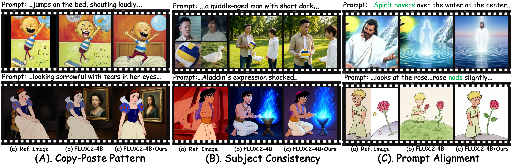

<h1 align="center">MorphSIG: Subject-Driven Image Generation via Decoupled Anchoring and Feature Transport</h1>


<blockquote style="text-align: justify;">
  <b>Abstract:</b> <i>We propose MorphSIG, a training-free framework that reformulates subject-driven image generation (SIG) as pseudo-video feature transport. MorphSIG contains two core modules: Progressive Decoupled Anchoring, which uses frequency-domain decoupling and structural scrambling during early denoising to break structural locking and enable a gradual transition from free composition to identity alignment; and Pseudo-flow Guided Feature Transport, which constructs a latent-space pseudo-flow field to mimic Image-to-Video temporal coherence and transport subject semantics precisely. To address stylistic homogeneity and the lack of ground truth in existing benchmarks, we further introduce a benchmark with diverse stylized subjects. Extensive experiments show that MorphSIG significantly improves pose diversity and subject fidelity over baselines without additional training. Overall, MorphSIG bridges static generation and dynamic propagation, providing a cost-effective paradigm for high-fidelity subject consistency. Code will be released.</i>
</blockquote>


<p align="center">
  
</p>

---


## Code Release
The source code for this project will be made publicly available once our paper is accepted for publication.


## SIGBenchmark: A Novel Benchmark for Multi-Subject Controllable Image Generation

[](#dataset-download)
[](https://opensource.org/licenses/MIT)

Robust evaluation metrics are essential for guiding multi-subject controllable image generation. While existing benchmarks (e.g., DreamBench, OmniGen2, XVerseBench) suffer from restricted subject scales or a lack of pixel-aligned ground truth, **SIGBenchmark** addresses these deficiencies by providing a meticulously curated dataset with precise pixel-level ground truth pairs. This enables mathematically rigorous, objective quantification of both semantic consistency and structural diversity.

### 🌟 Key Features

* **Extensive Subject Diversity:** Comprises **225 distinct subjects** organized within a scientific hierarchical taxonomy (spanning Humans, Animals, Objects, Artworks, and Virtual Avatars).
* **Complex Scene Compositions:** Features uniformly distributed, cross-category compositions supporting complex scenes of **2 to 4 subjects**.
* **High-Quality Ground Truth:** Includes exactly **750 ultra-high-fidelity sample groups**, each paired with detailed prompts and pixel-level ground truth images.
* **Rigorous Curation Pipeline:** Constructed via a hybrid pipeline integrating state-of-the-art MLLMs (Qwen3-VL-Plus, Qwen3.6-Plus, Nano Banana) and exhaustive human expert validation to ensure extreme visual fidelity and semantic richness.

### 📂 Dataset Download

The full dataset, including reference subjects, compositional prompts, and pixel-aligned ground truth images, is hosted on Google Drive.

* 📥 **[Download SIGBenchmark from Google Drive](https://drive.google.com/drive/folders/1H4VZexNrGFQMEwnPoHHjR3M2JX1Ucw6I?usp=drive_link)**

#### Data Structure

After downloading and unzipping the dataset, the directory structure will be organized as follows:

```text
SIGBenchmark/
├── huamn/                # 190 huamn single-subject reference images
├── animal/               # 30 animal single-subject reference images
├── object/               # 49ject single-subject reference images
├── outputs/              # 750 high-fidelity multi-subject ground truth images
├── prompts.json          # Combinatorial prompts and semantic descriptions
└── README.md
